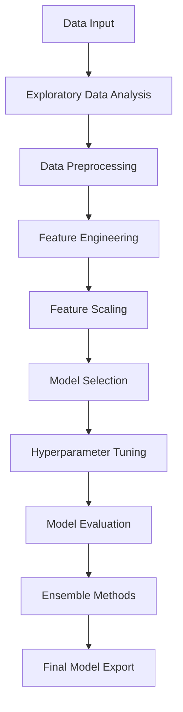

# 🤖 ML Pipeline Development Project
## 📋 Introduction

This project focuses on building a comprehensive Machine Learning (ML) pipeline that manages the entire lifecycle—from data ingestion and preprocessing to model deployment. The pipeline ensures fast iterations, optimal model selection, and seamless usability, making it suitable for both ML experts and non-experts.

## 📖 Documentation

### 🔗 Thesis and Research
For detailed methodology and research findings, please refer to our thesis document:
[**ML Pipeline Development Thesis**](https://drive.google.com/file/d/1PfuG28kqemSFcDXTJoGGkYOM-gMm2US0/view?usp=sharing)

## 🎯 Objectives

- **Modular Design**: Provide a modular pipeline that supports customization at each stage
- **User-Friendly Interface**: Offer an intuitive interface for model selection, evaluation, and reporting
- **Reproducibility**: Ensure consistency and reproducibility of results across multiple experiments
- **Scalability**: Support various data formats and machine learning algorithms
- **Automation**: Streamline the ML workflow from data preprocessing to model deployment

## ⚙️ Features

### 🔍 Data Ingestion
- Supports **CSV** and **XLSX** file formats
- Flexible data storage and retrieval modules
- Automatic data type detection and handling

### 📊 Exploratory Data Analysis (EDA)
- Interactive data visualizations with correlation heatmaps
- Scatter plots and distribution analysis
- Statistical summaries and data profiling
- Detects and analyzes outliers using box plots and descriptive analysis

### 🧹 Data Cleaning
- **Missing Data Handling**: Multiple imputation techniques (mean, median, mode, or random sample)
- **Outlier Detection**: Identifies and removes outliers using Tukey's Method or Z-Score filtering
- **Data Validation**: Ensures data quality and consistency

### 🔧 Feature Engineering  
- **Feature Selection**: Uses ExtraTreesClassifier-based importance ranking
- **Target Variable Selection**: Optimized training with proper target selection
- **Feature Creation**: Automated feature generation and transformation

### 📏 Feature Scaling
- **MinMaxScaler**: Normalizes features to a specific range
- **StandardScaler**: Standardizes features with zero mean and unit variance
- Automatic scaling method selection based on data characteristics

### 🎯 Model Selection & Tuning
- **Binary & Multiclass Classification**: Support for various classification problems
- **Multiple Algorithms**: 
  - Logistic Regression
  - K-Nearest Neighbors (KNN)
  - Support Vector Machine (SVM)
  - Decision Trees
  - Random Forest
  - Extra Trees
  - Gradient Boosting
  - AdaBoost
  - Naive Bayes
  - Linear Discriminant Analysis
- **Hyperparameter Tuning**: GridSearchCV and RandomizedSearchCV integration
- **Cross-Validation**: Stratified K-Fold validation for robust evaluation

### 🤝 Ensembling & Evaluation
- **Ensemble Methods**: 
  - Voting Classifier
  - Super Learner (Stacking)
  - Custom ensemble combinations
- **Comprehensive Metrics**: 
  - Accuracy, Precision, Recall, F1-Score
  - ROC-AUC, Precision-Recall AUC
  - Confusion Matrix visualization
  - Classification reports
- **Interactive Visualizations**: ROC curves, Precision-Recall curves

### 📄 Report Generation & Export
- **Model Export**: Save trained models as `.pkl` files
- **Performance Reports**: Detailed classification reports and evaluation summaries
- **Visualization Export**: Save plots and charts for documentation
- **Interactive Dashboard**: Real-time model performance monitoring

## 📈 Workflow Overview

1. **Data Input**: Load datasets from various sources (CSV, XLSX)
2. **EDA**: Explore data patterns with statistical and visual analysis
3. **Preprocessing**: Clean and prepare data for optimal model performance
4. **Feature Engineering**: Select and create relevant features
5. **Model Selection**: Train multiple algorithms and compare performance
6. **Hyperparameter Tuning**: Optimize model parameters for best results
7. **Evaluation**: Comprehensive performance assessment with multiple metrics
8. **Ensemble**: Combine models for improved accuracy and robustness
9. **Deployment**: Export trained models for production use

## 🛠️ Tech Stack

### **Core Technologies**
- **Python 3.8+**: Primary programming language
- **Streamlit**: Web application framework for interactive UI

### **Machine Learning & Data Science**
- **Scikit-learn**: Machine learning algorithms and utilities
- **Pandas**: Data manipulation and analysis
- **NumPy**: Numerical computing and array operations
- **MLens**: Advanced ensemble learning methods

### **Data Visualization**
- **Matplotlib**: Static plotting and visualization
- **Seaborn**: Statistical data visualization
- **Plotly**: Interactive plotting and dashboards

### **Additional Libraries**
- **Joblib**: Model serialization and parallel computing
- **Google GenAI**: AI-powered insights and recommendations
- **Base64**: Data encoding for export functionality
- **IO**: Input/output operations for file handling

## 🤝 Contributing

We welcome contributions to improve the ML Pipeline Development Project! Please follow these steps:

1. Fork the repository
2. Create a feature branch (`git checkout -b feature/AmazingFeature`)
3. Commit your changes (`git commit -m 'Add some AmazingFeature'`)
4. Push to the branch (`git push origin feature/AmazingFeature`)
5. Open a Pull Request

## 📄 License

This project is licensed under the MIT License - see the [LICENSE](LICENSE) file for details.

## 🙏 Acknowledgments

- Thanks to the open-source community for providing excellent libraries
- Special appreciation to the Streamlit team for the amazing framework
- Gratitude to scikit-learn contributors for robust ML algorithms

## 📧 Contact

For questions, suggestions, or collaboration opportunities, please reach out to any of the project authors.

---

## 👥 Authors

This project was developed by a dedicated team of researchers and developers:

- **[Aman Raut]** 
- **[Aniket Kaloo]**
- **[Atharva Nerkar]**
- **[Valhari Meshram]**
- **[Viranchi Dakhare]**

---

  
<strong>⭐ If you found this project helpful, please give it a star!</strong>

  
Made with ❤️ by the ML Pipeline Development Team

